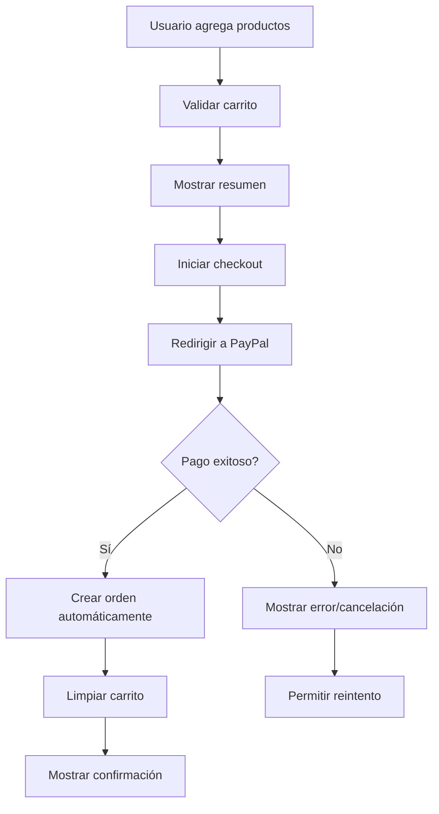

# 🚀 Resumen Ejecutivo para Equipo Frontend - Nabra XR

## 📋 Estado del Proyecto

✅ **Backend Completamente Implementado**
- Sistema de carrito de compras funcional
- Integración completa con PayPal
- Sistema de órdenes y pagos
- API REST completa y documentada
- Autenticación JWT implementada

## 🎯 Lo que Necesita el Frontend

### 📁 Archivos Entregados
1. **`API_DOCUMENTATION_FRONTEND.md`** - Documentación completa de todos los endpoints
2. **`FRONTEND_INTEGRATION_EXAMPLES.md`** - Ejemplos de código React/TypeScript
3. **`FRONTEND_TYPES.ts`** - Tipos TypeScript completos
4. **`API_ENDPOINTS_REFERENCE.md`** - Referencia rápida de endpoints

### 🔧 Configuración Requerida

#### Variables de Entorno
```bash
REACT_APP_API_URL=http://localhost:3000
REACT_APP_PAYPAL_CLIENT_ID=tu_paypal_client_id
REACT_APP_ENVIRONMENT=development
```

#### Dependencias NPM Recomendadas
```json
{
  "axios": "^1.6.0",
  "react-router-dom": "^6.8.0",
  "react-hook-form": "^7.48.0",
  "class-validator": "^0.14.0",
  "@types/node": "^18.15.0"
}
```

## 🛒 Funcionalidades Principales

### 1. Carrito de Compras
- ✅ Agregar/remover productos
- ✅ Actualizar cantidades
- ✅ Validación de stock en tiempo real
- ✅ Resumen de carrito con impuestos
- ✅ Validación antes del checkout

### 2. Sistema de Pagos
- ✅ Integración completa con PayPal
- ✅ Checkout completo del carrito
- ✅ Checkout parcial (seleccionar items específicos)
- ✅ Manejo de callbacks de éxito/cancelación
- ✅ Estados de pago en tiempo real

### 3. Órdenes
- ✅ Creación automática de órdenes
- ✅ Historial de órdenes del usuario
- ✅ Seguimiento de estados
- ✅ Resumen de órdenes

### 4. Autenticación
- ✅ Login/Registro
- ✅ JWT tokens
- ✅ Protección de rutas
- ✅ Gestión de sesiones

## 🔄 Flujo de Compra Completo



## 💡 Puntos Clave para el Frontend

### 1. Manejo de Estados
```typescript
// Estados importantes a manejar
type CartStatus = 'loading' | 'idle' | 'error';
type PaymentStatus = 'pending' | 'processing' | 'success' | 'failed';
type OrderStatus = 'pending' | 'confirmed' | 'shipped' | 'delivered';
```

### 2. URLs de Redirección PayPal
```typescript
const baseUrl = window.location.origin;
const returnUrl = `${baseUrl}/success`;
const cancelUrl = `${baseUrl}/cancel`;
```

### 3. Validación en Tiempo Real
- Validar carrito antes de cada checkout
- Verificar stock disponible
- Mostrar advertencias de stock bajo

### 4. Manejo de Errores
```typescript
// Errores comunes a manejar
- 400: Datos inválidos
- 401: Token expirado → redirigir a login
- 409: Stock insuficiente → mostrar alternativa
- 500: Error del servidor → mostrar mensaje genérico
```

## 🎨 Componentes Sugeridos

### 1. Carrito de Compras
- `CartItem` - Item individual del carrito
- `CartSummary` - Resumen con totales
- `CartValidation` - Validación y advertencias
- `QuantitySelector` - Selector de cantidad

### 2. Checkout
- `CheckoutForm` - Formulario de checkout
- `PaymentMethod` - Selección de método de pago
- `OrderSummary` - Resumen final del pedido

### 3. Páginas de Resultado
- `SuccessPage` - Pago exitoso
- `CancelPage` - Pago cancelado
- `ErrorPage` - Error en el pago

### 4. Órdenes
- `OrderList` - Lista de órdenes
- `OrderDetails` - Detalles de una orden
- `OrderStatus` - Estado de la orden

## 📱 Consideraciones Móviles

### 1. Responsive Design
- PayPal se adapta automáticamente a móviles
- Considerar navegación por pestañas en móvil
- Optimizar formularios para teclado móvil

### 2. Performance
- Lazy loading de imágenes
- Optimización de bundle size
- Cache de datos del carrito

### 3. UX Móvil
- Botones grandes para touch
- Feedback visual inmediato
- Estados de carga claros

## 🧪 Testing

### 1. Credenciales de Sandbox
```typescript
// Para testing con PayPal Sandbox
const sandboxCredentials = {
  email: 'sb-buyer@paypal.com',
  password: 'password123'
};
```

### 2. Casos de Prueba Críticos
- Flujo completo de compra
- Validación de carrito
- Manejo de errores de stock
- Redirecciones de PayPal
- Estados de carga

## 🚀 Próximos Pasos

### 1. Inmediato (Semana 1)
- [ ] Configurar proyecto React con TypeScript
- [ ] Implementar autenticación básica
- [ ] Crear componentes de carrito básicos
- [ ] Configurar integración con API

### 2. Corto Plazo (Semana 2-3)
- [ ] Implementar flujo completo de checkout
- [ ] Integrar PayPal
- [ ] Crear páginas de resultado
- [ ] Implementar manejo de órdenes

### 3. Mediano Plazo (Semana 4)
- [ ] Optimización móvil
- [ ] Testing completo
- [ ] Mejoras de UX
- [ ] Documentación de componentes

## 📞 Soporte Técnico

### Contacto Backend
- **Email:** backend@nabra-xr.com
- **Slack:** #backend-support
- **Horarios:** Lunes-Viernes 9AM-6PM

### Recursos Adicionales
- **API Docs:** http://localhost:3000/docs
- **Postman Collection:** [Descargar aquí]
- **Figma Designs:** [Enlace al diseño]

## ✅ Checklist de Entrega

### Funcionalidades Core
- [ ] Autenticación (login/registro)
- [ ] Catálogo de productos
- [ ] Carrito de compras
- [ ] Checkout con PayPal
- [ ] Historial de órdenes

### Calidad
- [ ] Responsive design
- [ ] Manejo de errores
- [ ] Loading states
- [ ] Validaciones
- [ ] Testing básico

### Performance
- [ ] Optimización de imágenes
- [ ] Lazy loading
- [ ] Bundle size optimizado
- [ ] Cache strategy

---

## 🎉 ¡Listo para Empezar!

El backend está **100% funcional** y listo para integración. Todos los endpoints están documentados, probados y optimizados. El equipo de frontend puede comenzar inmediatamente con la implementación usando los archivos y ejemplos proporcionados.

**¡Buena suerte con el desarrollo! 🚀**
