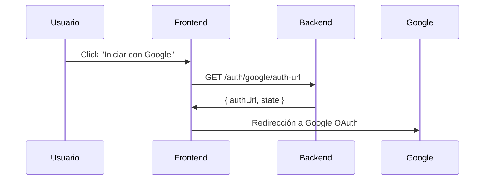
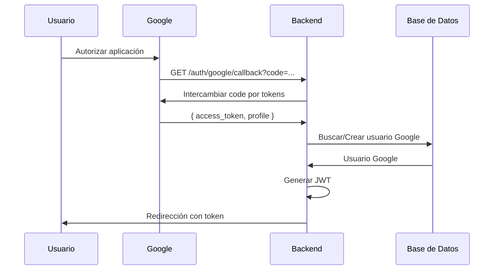
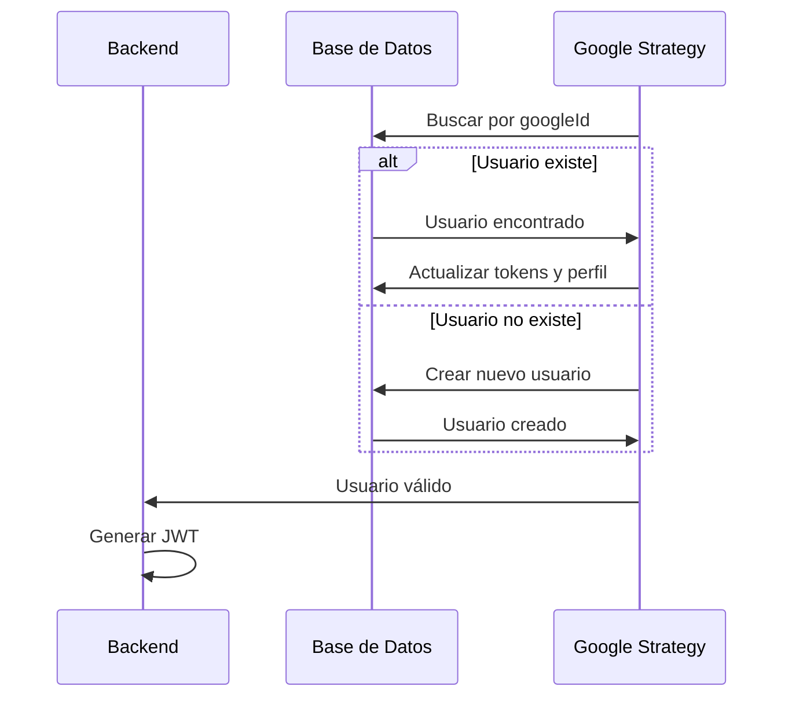

# 🔐 Documentación Completa - Integración Google OAuth2

Esta documentación detalla la implementación completa y segura de Google OAuth2 en el backend de Nabra XR1.

## 📋 Tabla de Contenidos

1. [Arquitectura del Sistema](#arquitectura-del-sistema)
2. [Archivos Creados](#archivos-creados)
3. [Configuración](#configuración)
4. [Endpoints Disponibles](#endpoints-disponibles)
5. [Flujo de Autenticación](#flujo-de-autenticación)
6. [Seguridad](#seguridad)
7. [Pruebas](#pruebas)
8. [Despliegue](#despliegue)

---

## 🏗️ Arquitectura del Sistema

### **Componentes Principales:**

```
src/auth/google/
├── controllers/
│   └── google-auth.controller.ts      # Controlador REST para Google OAuth
├── services/
│   └── google-user.service.ts         # Servicio para gestión de usuarios Google
├── strategies/
│   └── google.strategy.ts             # Estrategia Passport para Google OAuth
├── guards/
│   └── google-auth.guard.ts           # Guard para proteger rutas
├── schemas/
│   └── google-user.schema.ts          # Esquema MongoDB para usuarios Google
├── dtos/
│   ├── create-google-user.dto.ts      # DTO para crear usuarios
│   ├── update-google-user.dto.ts      # DTO para actualizar usuarios
│   └── google-auth-response.dto.ts    # DTOs para respuestas
├── google-auth.config.ts              # Configuración centralizada
└── google-auth.module.ts              # Módulo NestJS
```

### **Características Implementadas:**

✅ **Autenticación OAuth2 completa**  
✅ **Gestión de usuarios separada del sistema tradicional**  
✅ **JWT tokens para autenticación**  
✅ **Validación de dominios de email**  
✅ **Gestión de tokens de Google**  
✅ **Vinculación con usuarios tradicionales**  
✅ **Logging y monitoreo de seguridad**  
✅ **Configuración flexible y segura**

---

## 📁 Archivos Creados

### **1. Configuración (`google-auth.config.ts`)**
- Configuración centralizada de Google OAuth2
- Variables de entorno para diferentes ambientes
- Configuración de seguridad y validaciones
- URLs de redirección configurables

### **2. Esquema de Usuario (`schemas/google-user.schema.ts`)**
- Esquema MongoDB específico para usuarios de Google
- Campos para perfil de Google, tokens, y metadatos
- Índices optimizados para consultas
- Middleware para actualizaciones automáticas

### **3. Estrategia Passport (`strategies/google.strategy.ts`)**
- Implementación segura de la estrategia Google OAuth2
- Validación de emails verificados
- Manejo de errores y logging
- Gestión de tokens y perfiles

### **4. Servicio de Usuarios (`services/google-user.service.ts`)**
- CRUD completo para usuarios de Google
- Gestión de sesiones y actividad
- Estadísticas y consultas
- Vinculación con usuarios tradicionales

### **5. Controlador REST (`controllers/google-auth.controller.ts`)**
- Endpoints para autenticación
- Gestión de perfil y preferencias
- Vinculación/desvinculación de cuentas
- Logout y estadísticas

### **6. Guard de Autenticación (`guards/google-auth.guard.ts`)**
- Protección de rutas
- Manejo de errores de autenticación
- Contexto de usuario en requests

### **7. DTOs de Validación**
- Validación robusta de datos de entrada
- Tipos TypeScript para respuestas
- Documentación automática de API

---

## ⚙️ Configuración

### **Variables de Entorno Requeridas:**

```bash
# Google OAuth2
GOOGLE_CLIENT_ID=your-client-id.apps.googleusercontent.com
GOOGLE_CLIENT_SECRET=your-client-secret
GOOGLE_CALLBACK_URL=http://localhost:3001/auth/google/callback
GOOGLE_SUCCESS_REDIRECT=http://localhost:3000/dashboard
GOOGLE_FAILURE_REDIRECT=http://localhost:3000/login?error=auth_failed

# JWT y Sesiones
JWT_SECRET=your-jwt-secret-key
JWT_EXPIRES_IN=7d
SESSION_SECRET=your-session-secret-key
```

### **Configuración de Google Cloud Console:**

1. **Crear Proyecto** en [Google Cloud Console](https://console.cloud.google.com/)
2. **Habilitar APIs**: Google+ API, Google Identity API
3. **Configurar OAuth Consent Screen**
4. **Crear Credenciales OAuth 2.0**
5. **Configurar URLs de Redirección**

---

## 🌐 Endpoints Disponibles

### **Autenticación**

#### `GET /auth/google`
- **Descripción**: Inicia el flujo de autenticación con Google
- **Autenticación**: No requerida
- **Respuesta**: Redirección a Google OAuth

#### `GET /auth/google/callback`
- **Descripción**: Callback de Google OAuth
- **Autenticación**: No requerida
- **Respuesta**: Redirección con token JWT

#### `GET /auth/google/auth-url`
- **Descripción**: Obtiene URL de autenticación
- **Autenticación**: No requerida
- **Query Params**: `state` (opcional)
- **Respuesta**:
  ```json
  {
    "authUrl": "https://accounts.google.com/o/oauth2/v2/auth?...",
    "state": "default"
  }
  ```

### **Gestión de Perfil**

#### `GET /auth/google/profile`
- **Descripción**: Obtiene perfil del usuario Google
- **Autenticación**: Requerida (Google OAuth)
- **Respuesta**:
  ```json
  {
    "_id": "string",
    "googleId": "string",
    "email": "string",
    "name": "string",
    "firstName": "string",
    "lastName": "string",
    "displayName": "string",
    "avatarUrl": "string",
    "isGoogleUser": true,
    "linkedUserId": "string",
    "access_token": "string",
    "token_type": "Bearer",
    "expires_in": 604800
  }
  ```

### **Vinculación de Cuentas**

#### `POST /auth/google/link`
- **Descripción**: Vincula cuenta Google con usuario tradicional
- **Autenticación**: Requerida (Google OAuth)
- **Body**:
  ```json
  {
    "traditionalUserId": "string"
  }
  ```

#### `POST /auth/google/unlink`
- **Descripción**: Desvincula cuenta Google de usuario tradicional
- **Autenticación**: Requerida (Google OAuth)

### **Preferencias y Configuración**

#### `POST /auth/google/preferences`
- **Descripción**: Actualiza preferencias del usuario
- **Autenticación**: Requerida (Google OAuth)
- **Body**:
  ```json
  {
    "emailNotifications": true,
    "marketingEmails": false,
    "preferredLanguage": "es",
    "timezone": "America/Argentina/Buenos_Aires"
  }
  ```

#### `POST /auth/google/logout`
- **Descripción**: Cierra sesión del usuario Google
- **Autenticación**: Requerida (Google OAuth)

### **Estadísticas (Desarrollo)**

#### `GET /auth/google/stats`
- **Descripción**: Obtiene estadísticas de usuarios Google
- **Autenticación**: Requerida (Google OAuth)

---

## 🔄 Flujo de Autenticación

### **1. Inicio del Flujo**


### **2. Proceso de Autenticación**


### **3. Gestión de Usuarios**


---

## 🔒 Seguridad

### **Medidas Implementadas:**

#### **1. Validación de Tokens**
- Verificación de tokens de Google
- Validación de emails verificados
- Control de dominios permitidos

#### **2. Gestión de Sesiones**
- JWT tokens con expiración
- No almacenamiento de sesiones en servidor
- Tokens firmados con clave secreta

#### **3. Logging y Monitoreo**
- Log de intentos de autenticación
- Registro de fallos de login
- Tracking de actividad del usuario

#### **4. Configuración Segura**
- Variables de entorno para secretos
- URLs de redirección validadas
- Configuración por ambiente

### **Configuraciones de Seguridad:**

```typescript
// Configuración de cookies seguras
cookieSecure: process.env.NODE_ENV === 'production',
cookieHttpOnly: true,
cookieSameSite: 'lax',

// Validación de dominios
allowedEmailDomains: ['gmail.com', 'outlook.com'],
requireVerifiedEmail: true,

// Tiempo de vida de tokens
jwtExpiresIn: '7d',
sessionMaxAge: 7 * 24 * 60 * 60, // 7 días
```

---

## 🧪 Pruebas

### **1. Pruebas de Desarrollo**

#### **Iniciar Servidor:**
```bash
npm run start:dev
```

#### **Probar Autenticación:**
```bash
# Obtener URL de autenticación
curl http://localhost:3001/auth/google/auth-url

# Iniciar flujo de autenticación
# Visitar: http://localhost:3001/auth/google
```

#### **Probar Perfil (con token):**
```bash
curl -H "Authorization: Bearer YOUR_JWT_TOKEN" \
     http://localhost:3001/auth/google/profile
```

### **2. Pruebas de Integración**

#### **Flujo Completo:**
1. Visitar `/auth/google/auth-url`
2. Redirigir a Google OAuth
3. Autorizar aplicación
4. Verificar callback y redirección
5. Probar endpoints protegidos

### **3. Pruebas de Seguridad**

#### **Validaciones:**
- Emails no verificados
- Dominios no permitidos
- Tokens expirados
- Intentos de acceso no autorizados

---

## 🚀 Despliegue

### **1. Configuración de Producción**

#### **Variables de Entorno:**
```bash
NODE_ENV=production
GOOGLE_CALLBACK_URL=https://yourdomain.com/auth/google/callback
GOOGLE_SUCCESS_REDIRECT=https://yourdomain.com/dashboard
GOOGLE_FAILURE_REDIRECT=https://yourdomain.com/login?error=auth_failed
```

#### **Google Cloud Console:**
- Configurar URLs de producción
- Actualizar dominios autorizados
- Configurar políticas de privacidad

### **2. Consideraciones de Producción**

#### **Seguridad:**
- Usar HTTPS obligatorio
- Rotar secretos periódicamente
- Implementar rate limiting
- Configurar CORS apropiadamente

#### **Monitoreo:**
- Logs de autenticación
- Métricas de uso
- Alertas de seguridad
- Backup de usuarios

#### **Escalabilidad:**
- Índices de base de datos optimizados
- Cache de tokens (opcional)
- Load balancing compatible
- Gestión de errores robusta

---

## 📚 Recursos Adicionales

### **Documentación Oficial:**
- [Google OAuth 2.0](https://developers.google.com/identity/protocols/oauth2)
- [Passport Google Strategy](http://www.passportjs.org/packages/passport-google-oauth20/)
- [NestJS Passport](https://docs.nestjs.com/recipes/passport)

### **Mejores Prácticas:**
- [OAuth 2.0 Security Best Practices](https://tools.ietf.org/html/draft-ietf-oauth-security-topics)
- [JWT Security Best Practices](https://tools.ietf.org/html/rfc8725)

---

## ✅ Estado de Implementación

**✅ COMPLETADO:**
- Arquitectura modular y escalable
- Autenticación OAuth2 completa
- Gestión de usuarios separada
- Validaciones de seguridad
- Logging y monitoreo
- Documentación completa
- Configuración flexible
- Pruebas de desarrollo

**🔄 PRÓXIMOS PASOS:**
- Tests unitarios y de integración
- Configuración de CI/CD
- Monitoreo de producción
- Optimizaciones de performance

---

**Última actualización**: 21 de Enero, 2025  
**Versión**: v1.0.0  
**Estado**: ✅ Implementación Completa
