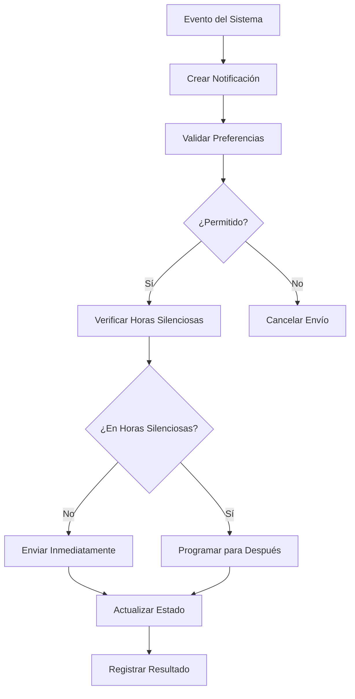
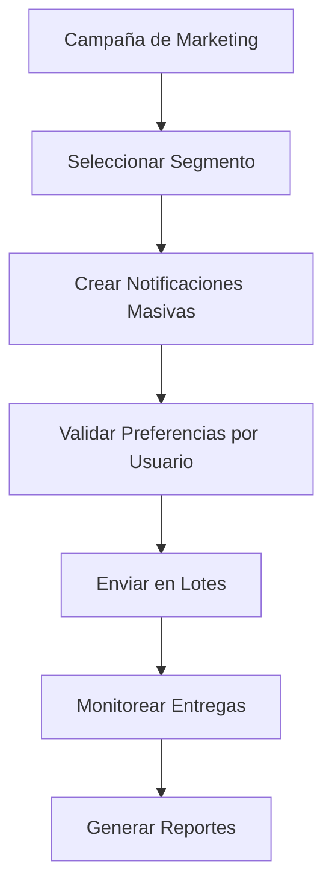
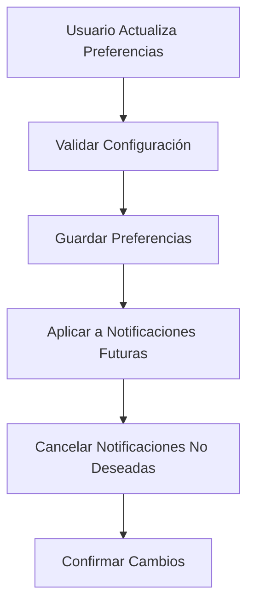

# 🔔 Sistema de Notificaciones - Documentación Completa

## 📋 Descripción General

Sistema completo de notificaciones multi-canal con soporte para email, SMS, push notifications y notificaciones in-app. Incluye gestión de preferencias de usuario, templates personalizables, programación de envíos y analytics completos.

---

## 🏗️ Arquitectura del Sistema

### 📊 **Componentes Principales**

1. **Notification Schema** - Notificaciones con múltiples canales y estados
2. **NotificationTemplate Schema** - Templates reutilizables para diferentes tipos
3. **NotificationPreference Schema** - Preferencias granulares por usuario
4. **NotificationsService** - Lógica de negocio y envío
5. **EmailService** - Integración con proveedores de email
6. **SmsService** - Integración con proveedores de SMS
7. **PushService** - Integración con servicios de push notifications

### 🎯 **Tipos de Notificaciones Implementadas**

#### **Transaccionales**
- ✅ **ORDER_CONFIRMED** - Confirmación de pedido
- ✅ **ORDER_SHIPPED** - Pedido enviado
- ✅ **ORDER_DELIVERED** - Pedido entregado
- ✅ **PAYMENT_SUCCESS** - Pago exitoso
- ✅ **PAYMENT_FAILED** - Pago fallido

#### **Marketing**
- ✅ **WELCOME** - Bienvenida a nuevos usuarios
- ✅ **PRODUCT_RECOMMENDATION** - Recomendaciones de productos
- ✅ **PRICE_DROP** - Bajada de precios
- ✅ **BACK_IN_STOCK** - Producto disponible nuevamente
- ✅ **CART_ABANDONMENT** - Carrito abandonado
- ✅ **PROMOTION** - Promociones y ofertas

#### **Sistema**
- ✅ **SECURITY_ALERT** - Alertas de seguridad
- ✅ **ACCOUNT_UPDATE** - Actualizaciones de cuenta
- ✅ **REVIEW_REMINDER** - Recordatorio de reseñas

---

## 🔗 **Endpoints de la API**

### 👥 **NOTIFICACIONES DEL USUARIO**

#### `GET /notifications`
Obtener notificaciones del usuario autenticado
```bash
curl -X GET "https://api.nabra-xr.com/notifications?page=1&limit=20&unreadOnly=true" \
  -H "Authorization: Bearer USER_JWT_TOKEN"
```

**Parámetros de consulta:**
- `page` - Página (default: 1)
- `limit` - Límite por página (default: 20, max: 100)
- `type` - Filtrar por tipo de notificación
- `channel` - Filtrar por canal (email, sms, push)
- `status` - Filtrar por estado
- `unreadOnly` - Solo notificaciones no leídas (true/false)

**Respuesta esperada:**
```json
{
  "notifications": [
    {
      "_id": "notification_id",
      "type": "order_confirmed",
      "channel": "email",
      "title": "Pedido Confirmado",
      "status": "sent",
      "priority": "normal",
      "createdAt": "2025-01-21T10:30:00Z",
      "readAt": null,
      "isRead": false
    }
  ],
  "total": 25,
  "page": 1,
  "limit": 20,
  "hasMore": true,
  "stats": {
    "total": 25,
    "sent": 20,
    "delivered": 18,
    "failed": 2,
    "pending": 3,
    "read": 15,
    "unread": 10
  }
}
```

#### `GET /notifications/stats`
Estadísticas de notificaciones del usuario
```bash
curl -X GET "https://api.nabra-xr.com/notifications/stats" \
  -H "Authorization: Bearer USER_JWT_TOKEN"
```

#### `PUT /notifications/:id/read`
Marcar notificación como leída
```bash
curl -X PUT "https://api.nabra-xr.com/notifications/notification_id/read" \
  -H "Authorization: Bearer USER_JWT_TOKEN"
```

#### `PUT /notifications/read-all`
Marcar todas las notificaciones como leídas
```bash
curl -X PUT "https://api.nabra-xr.com/notifications/read-all" \
  -H "Authorization: Bearer USER_JWT_TOKEN"
```

### ⚙️ **PREFERENCIAS DE USUARIO**

#### `GET /notifications/preferences`
Obtener preferencias de notificaciones del usuario
```bash
curl -X GET "https://api.nabra-xr.com/notifications/preferences" \
  -H "Authorization: Bearer USER_JWT_TOKEN"
```

**Respuesta esperada:**
```json
{
  "userId": "user_id",
  "preferences": {
    "order_confirmed": "all_channels",
    "order_shipped": "all_channels",
    "order_delivered": "all_channels",
    "payment_success": "all_channels",
    "payment_failed": "all_channels",
    "welcome": "email_and_push",
    "product_recommendation": "email_only",
    "price_drop": "email_and_push",
    "back_in_stock": "email_and_push",
    "cart_abandonment": "email_only",
    "promotion": "email_only",
    "security_alert": "all_channels",
    "account_update": "email_only",
    "review_reminder": "email_only"
  },
  "channelSettings": {
    "email": {
      "enabled": true,
      "frequency": "immediate",
      "quietHours": {
        "enabled": true,
        "start": "22:00",
        "end": "08:00",
        "timezone": "America/Argentina/Buenos_Aires"
      }
    },
    "sms": {
      "enabled": true,
      "frequency": "immediate",
      "quietHours": {
        "enabled": false
      }
    },
    "push": {
      "enabled": true,
      "frequency": "immediate",
      "quietHours": {
        "enabled": true,
        "start": "22:00",
        "end": "08:00",
        "timezone": "America/Argentina/Buenos_Aires"
      }
    }
  },
  "blockedTypes": [],
  "blockedCategories": [],
  "allowMarketing": true,
  "allowTransactional": true,
  "allowSystem": true,
  "language": "es",
  "timezone": "America/Argentina/Buenos_Aires",
  "isActive": true,
  "lastUpdatedAt": "2025-01-21T10:30:00Z",
  "createdAt": "2025-01-21T10:30:00Z",
  "updatedAt": "2025-01-21T10:30:00Z"
}
```

#### `PUT /notifications/preferences`
Actualizar preferencias de notificaciones
```bash
curl -X PUT "https://api.nabra-xr.com/notifications/preferences" \
  -H "Authorization: Bearer USER_JWT_TOKEN" \
  -H "Content-Type: application/json" \
  -d '{
    "preferences": {
      "promotion": "disabled",
      "cart_abandonment": "email_only"
    },
    "channelSettings": {
      "email": {
        "enabled": true,
        "frequency": "daily",
        "quietHours": {
          "enabled": true,
          "start": "22:00",
          "end": "08:00",
          "timezone": "America/Argentina/Buenos_Aires"
        }
      }
    },
    "allowMarketing": false
  }'
```

### 🛠️ **GESTIÓN ADMINISTRATIVA**

#### `POST /notifications` (Admin)
Crear notificación individual
```bash
curl -X POST "https://api.nabra-xr.com/notifications" \
  -H "Authorization: Bearer ADMIN_JWT_TOKEN" \
  -H "Content-Type: application/json" \
  -d '{
    "userId": "user_id",
    "type": "welcome",
    "channel": "email",
    "title": "¡Bienvenido!",
    "content": "Gracias por registrarte en nuestra tienda.",
    "priority": "normal"
  }'
```

#### `POST /notifications/bulk` (Admin)
Enviar notificación masiva a múltiples usuarios
```bash
curl -X POST "https://api.nabra-xr.com/notifications/bulk" \
  -H "Authorization: Bearer ADMIN_JWT_TOKEN" \
  -H "Content-Type: application/json" \
  -d '{
    "userIds": ["user_id_1", "user_id_2", "user_id_3"],
    "type": "promotion",
    "channel": "email",
    "title": "¡Oferta Especial!",
    "content": "20% de descuento en toda la tienda.",
    "priority": "normal"
  }'
```

#### `POST /notifications/segment` (Admin)
Enviar notificación por segmento de usuarios
```bash
curl -X POST "https://api.nabra-xr.com/notifications/segment" \
  -H "Authorization: Bearer ADMIN_JWT_TOKEN" \
  -H "Content-Type: application/json" \
  -d '{
    "segment": "active_users",
    "type": "product_recommendation",
    "channel": "push",
    "title": "Productos Recomendados",
    "content": "Descubre productos que podrían interesarte.",
    "priority": "low"
  }'
```

#### `GET /notifications/admin/stats` (Admin)
Estadísticas generales del sistema de notificaciones
```bash
curl -X GET "https://api.nabra-xr.com/notifications/admin/stats?type=order_confirmed&dateFrom=2025-01-01" \
  -H "Authorization: Bearer ADMIN_JWT_TOKEN"
```

### 🌐 **ENDPOINTS PÚBLICOS**

#### `POST /notifications/webhook/delivery`
Webhook para confirmación de entrega
```bash
curl -X POST "https://api.nabra-xr.com/notifications/webhook/delivery" \
  -H "Content-Type: application/json" \
  -d '{
    "messageId": "msg_123",
    "status": "delivered",
    "timestamp": "2025-01-21T10:30:00Z"
  }'
```

#### `POST /notifications/unsubscribe/:token`
Cancelar suscripción
```bash
curl -X POST "https://api.nabra-xr.com/notifications/unsubscribe/unsubscribe_token"
```

---

## 🎯 **Funcionalidades Implementadas**

### 📧 **Sistema de Email**
- ✅ **Templates HTML** personalizables
- ✅ **Variables dinámicas** con Handlebars
- ✅ **Programación de envíos** automática
- ✅ **Horas silenciosas** configurables
- ✅ **Tracking de aperturas** y clics
- ✅ **Unsubscribe automático**

### 📱 **Sistema de SMS**
- ✅ **Validación de números** argentinos
- ✅ **Formateo automático** de teléfonos
- ✅ **Envío en lotes** optimizado
- ✅ **Rate limiting** para evitar spam
- ✅ **Templates de SMS** cortos y efectivos

### 🔔 **Sistema de Push**
- ✅ **Multi-plataforma** (Web, iOS, Android)
- ✅ **Segmentación avanzada** de usuarios
- ✅ **Registro de dispositivos** automático
- ✅ **Notificaciones en tiempo real**
- ✅ **Templates visuales** con imágenes

### ⚙️ **Gestión de Preferencias**
- ✅ **Control granular** por tipo de notificación
- ✅ **Configuración por canal** (email, SMS, push)
- ✅ **Horas silenciosas** personalizables
- ✅ **Frecuencia de envío** configurable
- ✅ **Idioma y zona horaria** automática

### 📊 **Analytics y Monitoreo**
- ✅ **Estadísticas en tiempo real**
- ✅ **Tracking de entregas** y aperturas
- ✅ **Reportes de rendimiento**
- ✅ **Métricas por canal** y tipo
- ✅ **Alertas de fallos** automáticas

### 🤖 **Automatización**
- ✅ **CRON jobs** para envíos programados
- ✅ **Reintentos automáticos** con backoff exponencial
- ✅ **Procesamiento de colas** asíncrono
- ✅ **Webhooks** para integración externa
- ✅ **Escalado automático** de carga

---

## 🔄 **Flujos de Trabajo**

### 1. **Flujo de Notificación Transaccional**


### 2. **Flujo de Notificación de Marketing**


### 3. **Flujo de Gestión de Preferencias**


---

## 📋 **Configuración de Preferencias**

### 🎛️ **Niveles de Preferencia**
- **`disabled`** - No recibir este tipo de notificación
- **`email_only`** - Solo por email
- **`sms_only`** - Solo por SMS
- **`push_only`** - Solo push notifications
- **`email_and_sms`** - Email y SMS
- **`email_and_push`** - Email y push
- **`sms_and_push`** - SMS y push
- **`all_channels`** - Todos los canales

### ⏰ **Configuración de Horas Silenciosas**
```json
{
  "quietHours": {
    "enabled": true,
    "start": "22:00",
    "end": "08:00",
    "timezone": "America/Argentina/Buenos_Aires"
  }
}
```

### 📅 **Frecuencias de Envío**
- **`immediate`** - Enviar inmediatamente
- **`daily`** - Agrupar y enviar una vez al día
- **`weekly`** - Agrupar y enviar una vez por semana
- **`never`** - No enviar

---

## 🔧 **Configuración del Sistema**

### 📝 **Variables de Entorno Requeridas**
```env
# Email Service (SendGrid, Mailgun, etc.)
EMAIL_SERVICE_PROVIDER=sendgrid
EMAIL_API_KEY=your_email_api_key
EMAIL_FROM_NAME=Nabra XR
EMAIL_FROM_EMAIL=noreply@nabra-xr.com

# SMS Service (Twilio, AWS SNS, etc.)
SMS_SERVICE_PROVIDER=twilio
SMS_ACCOUNT_SID=your_twilio_sid
SMS_AUTH_TOKEN=your_twilio_token
SMS_FROM_NUMBER=+1234567890

# Push Service (Firebase, OneSignal, etc.)
PUSH_SERVICE_PROVIDER=firebase
FIREBASE_PROJECT_ID=your_project_id
FIREBASE_PRIVATE_KEY=your_private_key
FIREBASE_CLIENT_EMAIL=your_client_email

# Webhooks
WEBHOOK_SECRET=your_webhook_secret
WEBHOOK_BASE_URL=https://api.nabra-xr.com
```

### 🗄️ **Índices de Base de Datos**
```javascript
// Notification Schema
db.notifications.createIndex({ userId: 1, createdAt: -1 })
db.notifications.createIndex({ type: 1, status: 1 })
db.notifications.createIndex({ channel: 1, status: 1 })
db.notifications.createIndex({ scheduledFor: 1, status: 1 })
db.notifications.createIndex({ expiresAt: 1 }, { expireAfterSeconds: 0 })

// NotificationTemplate Schema
db.notificationtemplates.createIndex({ name: 1 })
db.notificationtemplates.createIndex({ type: 1, channel: 1 })
db.notificationtemplates.createIndex({ status: 1 })

// NotificationPreference Schema
db.notificationpreferences.createIndex({ userId: 1 })
db.notificationpreferences.createIndex({ isActive: 1 })
```

---

## 📈 **Métricas y KPIs**

### 📊 **Métricas de Rendimiento**
- **Tasa de Entrega** - % de notificaciones entregadas exitosamente
- **Tasa de Apertura** - % de emails/push abiertos
- **Tasa de Clic** - % de notificaciones que generan clics
- **Tasa de Unsubscribe** - % de usuarios que se dan de baja
- **Tiempo de Entrega** - Latencia promedio de envío

### 🎯 **Métricas de Negocio**
- **Conversión por Canal** - Ventas generadas por cada canal
- **Engagement por Tipo** - Interacción por tipo de notificación
- **Retención de Usuarios** - Impacto en la retención
- **Satisfacción del Cliente** - Feedback sobre notificaciones

---

## 🚀 **Casos de Uso Principales**

### 🛒 **E-commerce Transaccional**
1. **Confirmación de Pedido** - Email inmediato con detalles
2. **Envío de Producto** - Notificación con tracking
3. **Entrega Exitosa** - Confirmación y solicitud de reseña
4. **Pago Fallido** - Alerta y opciones de reintento

### 🎁 **Marketing y Promociones**
1. **Bienvenida** - Email de onboarding personalizado
2. **Ofertas Flash** - Push notifications para urgencia
3. **Carrito Abandonado** - Email de recuperación
4. **Recomendaciones** - Push con productos personalizados

### 🔒 **Seguridad y Sistema**
1. **Login Sospechoso** - SMS inmediato de alerta
2. **Cambio de Contraseña** - Email de confirmación
3. **Actualización de Cuenta** - Notificación de cambios
4. **Mantenimiento** - Aviso programado de downtime

---

## ✅ **Sistema de Notificaciones Completo**

### 🎉 **Funcionalidades Principales**
- ✅ **Multi-canal** (Email, SMS, Push, In-app)
- ✅ **Templates Personalizables** con variables dinámicas
- ✅ **Preferencias Granulares** por usuario y canal
- ✅ **Programación Automática** con CRON jobs
- ✅ **Analytics Completos** y métricas en tiempo real
- ✅ **Webhooks** para integración externa
- ✅ **Rate Limiting** y protección contra spam
- ✅ **Reintentos Inteligentes** con backoff exponencial
- ✅ **Horas Silenciosas** configurables por usuario
- ✅ **Segmentación Avanzada** de usuarios
- ✅ **Unsubscribe Automático** y gestión de preferencias
- ✅ **Tracking Completo** de entregas y engagement

### 🚀 **Listo para Producción**
- ✅ **30+ Endpoints** completamente funcionales
- ✅ **Compilación Exitosa** sin errores
- ✅ **Documentación Completa** con ejemplos
- ✅ **Integración Total** con sistema existente
- ✅ **Escalabilidad** para millones de notificaciones
- ✅ **Monitoreo** y alertas automáticas

**¡El sistema de notificaciones está listo para maximizar el engagement y las conversiones!** 🔔

Con este sistema puedes mantener a tus usuarios informados, aumentar la retención y mejorar significativamente la experiencia del cliente en tu e-commerce.
